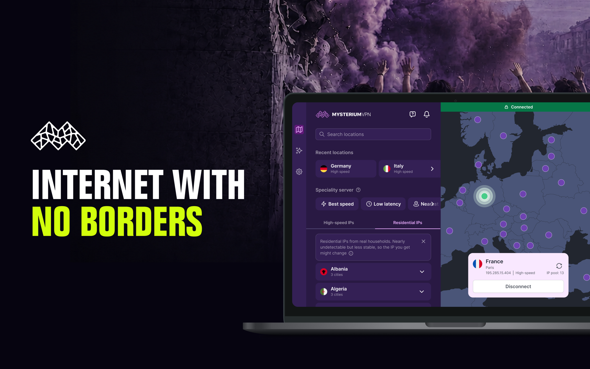
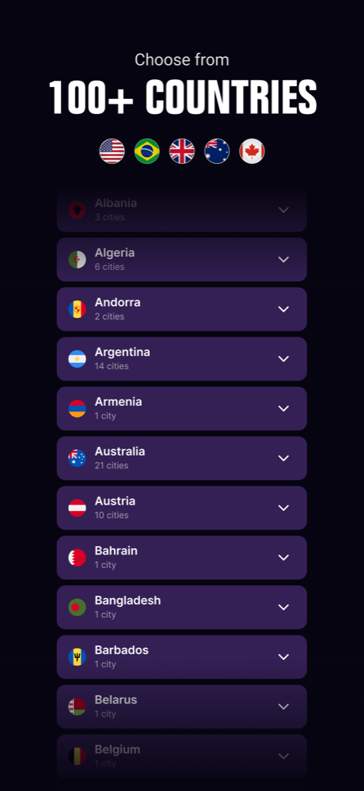
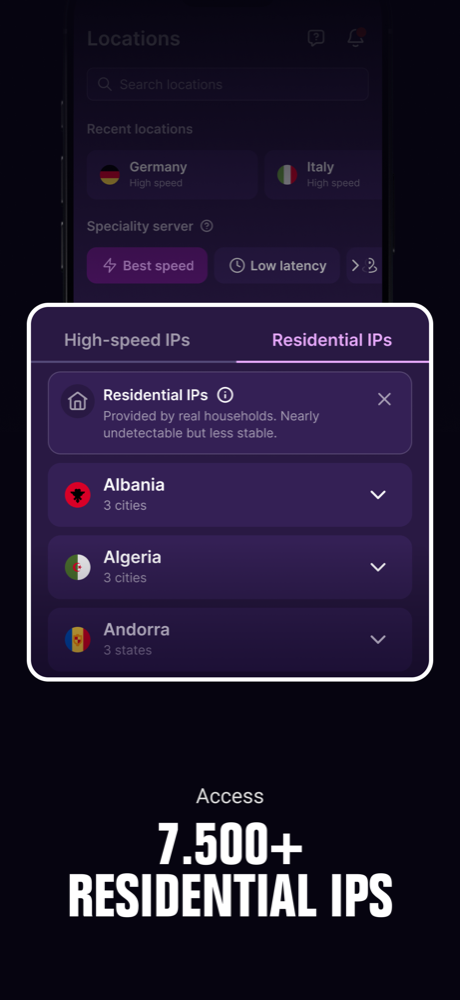
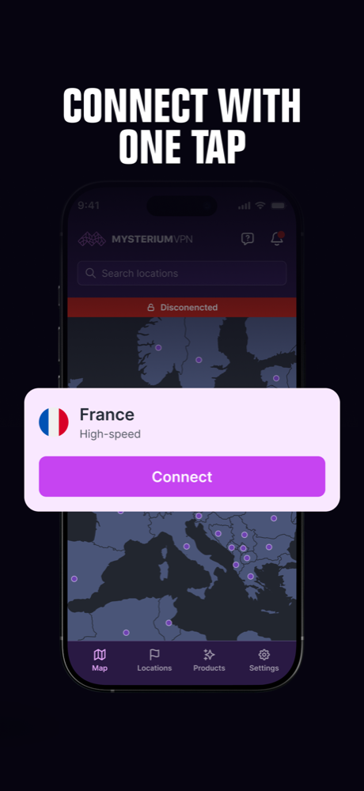

<div align="center">
  <picture>
    <source media="(prefers-color-scheme: dark)" srcset="assets/logo/logo_stacked_dark.svg">
    
  </picture>

  <h1>Mysterium VPN</h1>

  <p>Next-gen Mysterium VPN client — a single Flutter codebase for mobile and desktop,<br>
  powered by the world's largest residential IP network.</p>

  <p>
    <a href="LICENSE"></a>
    
    
  </p>
</div>



<p align="center">
  
  
  
</p>

## Download

<p>
  <a href="https://play.google.com/store/apps/details?id=com.mysteriumvpn.android"></a>
  <a href="https://apps.apple.com/app/mysterium-vpn/id6446624307"></a>
  <a href="https://github.com/mysteriumnetwork/mysterium-vpn-release/releases"></a>
  <a href="https://www.mysteriumvpn.com/downloads"></a>
</p>

| Platform | Availability |
| --- | --- |
| Android | [Google Play](https://play.google.com/store/apps/details?id=com.mysteriumvpn.android) |
| iOS | [App Store](https://apps.apple.com/app/mysterium-vpn/id6446624307) |
| macOS | [App Store](https://apps.apple.com/app/mysterium-vpn/id6446624307) · [mysteriumvpn.com](https://www.mysteriumvpn.com/downloads) |
| Windows | [GitHub Releases](https://github.com/mysteriumnetwork/mysterium-vpn-release/releases) · [mysteriumvpn.com](https://www.mysteriumvpn.com/downloads) |
| Linux | Upcoming |

## Features

- Residential and datacenter IPs in 135+ countries
- WireGuard® and OpenVPN protocols
- One codebase for all platforms, built with [Flutter](https://flutter.dev)
- No-log policy — see our [privacy policy](https://www.mysteriumvpn.com/privacy-policy-vpn)

## Build instructions

### Prerequisites

- [FVM](https://fvm.app) — the Flutter version (currently `3.44.7`) is pinned in `.fvmrc`
- `make`
- Platform toolchains: Android Studio/SDK for Android, Xcode + CocoaPods for iOS/macOS

### Environment

Runtime configuration (API base URLs, SDK keys, etc.) is supplied at compile time via
`--dart-define-from-file .env.<flavor>`. The `.env.dev` / `.env.prod` files are not committed —
the full list of expected variables is defined in [`lib/env.dart`](lib/env.dart).

### Run

```sh
git clone https://github.com/mysteriumnetwork/mysterium-vpn.git
cd mysterium-vpn
fvm install     # installs the Flutter version pinned in .fvmrc
make run-dev
```

`make run-dev` fetches dependencies, runs code generation, and starts the app in the `dev` flavor.
Other useful targets:

```sh
make generate           # regenerate MobX/Freezed/JSON/asset codegen + format
make run-unit-tests     # full unit-test suite (dev + prod env passes)
make run-integration-tests  # Patrol integration tests on a connected device
```

## Project structure

```
lib/
├── services/      # external I/O — API, auth, VPN engines, MQTT, location, storage
├── repositories/  # data access built on top of services
├── stores/        # MobX stores — business logic and state
├── providers/     # Riverpod providers wiring services, repositories and stores
├── views/         # UI — together with pages/ and components/
└── common/        # router (Beamer), enums, hooks, extensions, utils
```

UI widgets come from the [mysterium-vpn-design](https://github.com/mysteriumnetwork/mysterium-vpn-design)
package, and the backend client lives in
[mysterium-vpn-api-client-dart](https://github.com/mysteriumnetwork/mysterium-vpn-api-client-dart).

## Code style

- Formatting: `dart format` with `--line-length 100`
- Lints: `flutter_lints` plus a strict custom rule set — run `fvm flutter analyze` before submitting
- Generated files (`*.g.dart`, `*.freezed.dart`) are never edited by hand — use `make generate`

## Contributing

Contributions are welcome! Before you start:

1. **Search [existing issues](../../issues) and [pull requests](../../pulls)** to avoid duplicating work.
2. **Open an issue first** for significant changes or new features, so the approach can be discussed before you invest time in it.
3. **Follow the existing conventions.** The codebase uses MobX stores for business logic, Riverpod providers for wiring, and Beamer for routing — new code should fit that architecture, not work around it.
4. **Keep pull requests focused** — one change per PR, with a clear description of what it does and why.
5. **Add tests** for the code you change and make sure the checks pass locally:

```sh
fvm flutter analyze
make run-unit-tests
```

By making a contribution to this project:

1. You assure that the contribution is your original work and that you have the right to license it under the terms of this repository's [GPL-2.0 license](LICENSE).
2. You agree that your contribution is licensed under the GPL-2.0 license, and you agree to any future changes in licensing.
3. You understand and agree that this project and your contribution are public, and that a record of the contribution (including all personal information you submit with it) is maintained indefinitely and may be redistributed with this project.

## Reporting issues

- **Bugs and feature requests:** open a [GitHub issue](../../issues).
- **Security vulnerabilities:** please do **not** open a public issue — report them privately to [help@mysteriumvpn.com](mailto:help@mysteriumvpn.com).

## Related repositories

| Repository | Purpose |
| --- | --- |
| [mysterium-vpn-design](https://github.com/mysteriumnetwork/mysterium-vpn-design) | Flutter design system used by the app |
| [mysterium-vpn-api-client-dart](https://github.com/mysteriumnetwork/mysterium-vpn-api-client-dart) | Dart client for the Mysterium VPN API |
| [wireguard_dart](https://github.com/mysteriumnetwork/wireguard_dart) | WireGuard® Flutter plugin |
| [openvpn_dart](https://github.com/mysteriumnetwork/openvpn_dart) | OpenVPN Flutter plugin |
| [mysterium-vpn-release](https://github.com/mysteriumnetwork/mysterium-vpn-release) | Windows release artifacts |

## License

This project is licensed under the GNU General Public License v2.0 — see the [LICENSE](LICENSE) file for details.

WireGuard® is a registered trademark of Jason A. Donenfeld. OpenVPN® is a registered trademark of OpenVPN Inc.
